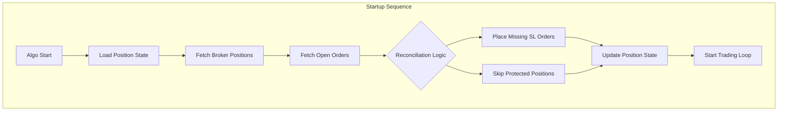
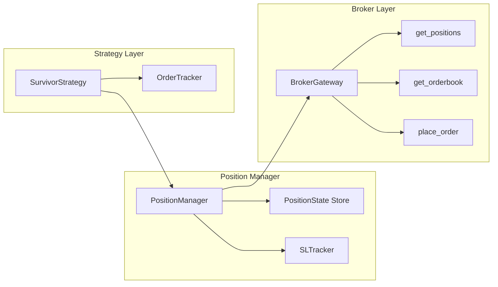

# Product Requirements Document (PRD)
## SL Order Reconciliation for Trading Day Startup

**Version:** 1.0  
**Date:** 2026-02-23  
**Author:** Trading Algo Team  
**Status:** Draft

---

## 1. Executive Summary

This document outlines the requirements for implementing a Stop-Loss (SL) Order Reconciliation feature that automatically handles SL order placement when the trading algorithm starts on a new trading day. Since SL orders are typically valid only for a single trading day (DAY validity), they get cancelled at end of day. This feature ensures that existing positions are protected with appropriate SL orders when the algo restarts.

---

## 2. Problem Statement

### Current Situation
- Trading algorithm places SELL orders for options (PE/CE) based on strategy signals
- SL orders placed to protect short positions have DAY validity
- At end of trading day, all DAY orders are automatically cancelled by the exchange/broker
- When algo restarts next day, existing positions have no SL protection

### Pain Points
1. **Risk Exposure:** Positions remain unprotected until manual intervention
2. **Manual Overhead:** Traders must manually place SL orders each morning
3. **Inconsistency:** Risk of placing incorrect SL quantities or prices
4. **Duplicate Orders:** No tracking mechanism to prevent placing multiple SL orders for same position

---

## 3. Goals and Objectives

### Primary Goals
1. **Automatic SL Placement:** When algo starts, automatically detect open positions and place SL orders
2. **Reconciliation:** Ensure SL orders match actual positions - no extra orders, no missing orders
3. **Idempotency:** Running the reconciliation multiple times should not create duplicate SL orders

### Success Metrics
- Zero instances of unprotected positions at market open
- 100% accuracy in SL quantity matching position quantity
- Zero duplicate SL orders placed for same position

---

## 4. Scope

### In Scope
- Detection of open short positions at algo startup
- Calculation of appropriate SL prices based on position entry price
- Placement of SL orders for unprotected positions
- Tracking of SL order IDs mapped to positions
- Reconciliation logic to prevent duplicate SL orders
- Support for multiple brokers (Zerodha, Fyers, Fyrodha)

### Out of Scope
- Modification of existing SL orders during trading hours
- Trailing SL functionality
- SL order modification based on price movement
- GTT (Good Till Triggered) orders

---

## 5. Technical Architecture

### 5.1 System Context



### 5.2 Component Design



### 5.3 Data Structures

#### PositionState
```python
@dataclass
class PositionState:
    symbol: str                    # Trading symbol e.g. NIFTY24FEB18000CE
    exchange: Exchange             # NFO
    quantity: int                  # Position quantity (negative for short)
    entry_price: float             # Average entry price
    product_type: ProductType      # NRML/MIS
    sl_order_id: Optional[str]     # Linked SL order ID
    sl_trigger_price: Optional[float]  # SL trigger price
    sl_limit_price: Optional[float]    # SL limit price
    sl_percentage: float           # SL percentage from config
    last_updated: datetime         # Timestamp of last update
    position_id: str               # Unique identifier (symbol + exchange + product)
```

#### SLReconciliationResult
```python
@dataclass
class SLReconciliationResult:
    total_positions: int
    protected_positions: int       # Already have SL orders
    new_sl_placed: int             # New SL orders placed
    sl_orders_placed: List[OrderResponse]
    errors: List[str]
    skipped_positions: List[str]   # Positions with existing SL
```

---

## 6. Functional Requirements

### FR-1: Position Detection at Startup
**Priority:** P0 (Critical)

**Description:** System must detect all open positions from broker when algo starts.

**Acceptance Criteria:**
- AC-1.1: Fetch all positions using `broker.get_positions()`
- AC-1.2: Filter for short positions (quantity < 0) in configured symbols
- AC-1.3: Filter by product type (NRML for carry-forward positions)
- AC-1.4: Store positions in local state with unique identifiers

### FR-2: SL Order Detection
**Priority:** P0 (Critical)

**Description:** System must detect existing SL orders to avoid duplicates.

**Acceptance Criteria:**
- AC-2.1: Fetch all open orders using `broker.get_orderbook()`
- AC-2.2: Filter for SL/SL-M order types
- AC-2.3: Filter for BUY transaction type (to cover short positions)
- AC-2.4: Match SL orders to positions by symbol
- AC-2.5: Mark positions as protected if matching SL order exists

### FR-3: SL Price Calculation
**Priority:** P0 (Critical)

**Description:** System must calculate appropriate SL prices for each position.

**Acceptance Criteria:**
- AC-3.1: Use configurable SL percentage (default 60%)
- AC-3.2: For short positions: `sl_trigger = entry_price * (1 + sl_percentage/100)`
- AC-3.3: Calculate SL limit price with buffer: `sl_limit = sl_trigger + sl_buffer`
- AC-3.4: Support both SL-M (market) and SL-Limit order types
- AC-3.5: Validate SL prices are within valid price bands

### FR-4: SL Order Placement
**Priority:** P0 (Critical)

**Description:** System must place SL orders for unprotected positions.

**Acceptance Criteria:**
- AC-4.1: Create OrderRequest with order_type = STOP_LIMIT or STOP
- AC-4.2: Set transaction_type = BUY (to cover short position)
- AC-4.3: Set quantity = abs(position_quantity)
- AC-4.4: Set stop_price = calculated trigger price
- AC-4.5: Set price = calculated limit price (for SL-Limit)
- AC-4.6: Add tag for tracking (e.g., "SL_AUTO")
- AC-4.7: Store SL order ID in position state

### FR-5: Reconciliation Logic
**Priority:** P0 (Critical)

**Description:** System must reconcile positions with SL orders accurately.

**Acceptance Criteria:**
- AC-5.1: Compare position quantity with SL order quantity
- AC-5.2: If SL quantity < position quantity, place additional SL for difference
- AC-5.3: If SL quantity > position quantity, log warning (manual review needed)
- AC-5.4: If SL quantity == position quantity, skip (already protected)
- AC-5.5: Generate reconciliation report

### FR-6: State Persistence
**Priority:** P1 (High)

**Description:** System must persist position-SL mapping across restarts.

**Acceptance Criteria:**
- AC-6.1: Save position state to JSON file after each SL placement
- AC-6.2: Load position state at startup before reconciliation
- AC-6.3: Handle corrupted/missing state file gracefully
- AC-6.4: Include timestamp for audit trail

### FR-7: Configuration Support
**Priority:** P1 (High)

**Description:** System must support configurable SL parameters.

**Acceptance Criteria:**
- AC-7.1: Add `sl_percentage` to strategy config (default: 60)
- AC-7.2: Add `sl_limit_buffer` to strategy config (default: 5 points)
- AC-7.3: Add `sl_order_type` to strategy config (SL-M or SL-Limit)
- AC-7.4: Add `sl_enabled` flag to enable/disable auto SL placement
- AC-7.5: Support per-strategy SL configuration

---

## 7. Non-Functional Requirements

### NFR-1: Reliability
- SL reconciliation must complete within 30 seconds of algo startup
- System must handle broker API failures gracefully with retry logic
- No position should remain unprotected after successful reconciliation

### NFR-2: Performance
- Position state file I/O should not block trading loop
- Support for up to 50 concurrent positions
- API calls should be batched where possible

### NFR-3: Maintainability
- Clear separation between position management and strategy logic
- Comprehensive logging for debugging
- Unit tests for all reconciliation scenarios

### NFR-4: Security
- Position state file should not contain sensitive credentials
- SL orders should respect broker rate limits

---

## 8. Implementation Plan

### Phase 1: Core Infrastructure
1. Create `PositionManager` class in new module `position_manager.py`
2. Define `PositionState` dataclass with SL tracking fields
3. Implement position state persistence (JSON file)

### Phase 2: Reconciliation Logic
1. Implement position detection from broker
2. Implement SL order detection from orderbook
3. Implement SL price calculation
4. Implement SL order placement
5. Implement reconciliation matching logic

### Phase 3: Integration
1. Integrate `PositionManager` with `SurvivorStrategy`
2. Add startup reconciliation call in main script
3. Update strategy config files with SL parameters

### Phase 4: Testing & Validation
1. Unit tests for SL price calculation
2. Unit tests for reconciliation logic
3. Integration tests with mock broker
4. Paper trading validation

---

## 9. API Design

### PositionManager Class

```python
class PositionManager:
    """
    Manages position tracking and SL order reconciliation.
    
    Responsibilities:
    - Track open positions with SL order mapping
    - Reconcile broker positions with local state
    - Place missing SL orders at startup
    - Persist position state to disk
    """
    
    def __init__(
        self,
        broker: BrokerGateway,
        config: Dict[str, Any],
        state_file: str = "artifacts/position_state.json"
    ):
        self.broker = broker
        self.config = config
        self.state_file = state_file
        self._position_states: Dict[str, PositionState] = {}
        
    def reconcile_at_startup(self) -> SLReconciliationResult:
        """
        Main entry point for SL reconciliation at algo startup.
        
        Steps:
        1. Load persisted position state
        2. Fetch current broker positions
        3. Fetch open SL orders
        4. Identify unprotected positions
        5. Place SL orders for unprotected positions
        6. Update and persist position state
        
        Returns:
            SLReconciliationResult with details of actions taken
        """
        pass
    
    def get_unprotected_positions(self) -> List[PositionState]:
        """Return positions without active SL orders."""
        pass
    
    def place_sl_order(self, position: PositionState) -> OrderResponse:
        """Place SL order for a single position."""
        pass
    
    def calculate_sl_prices(
        self, 
        entry_price: float,
        quantity: int
    ) -> Tuple[float, Optional[float]]:
        """
        Calculate SL trigger and limit prices.
        
        Args:
            entry_price: Position entry price
            quantity: Position quantity (negative for short)
            
        Returns:
            Tuple of (trigger_price, limit_price)
        """
        pass
    
    def update_position_state(
        self,
        symbol: str,
        sl_order_id: str,
        sl_trigger: float,
        sl_limit: Optional[float]
    ) -> None:
        """Update position state after SL placement."""
        pass
    
    def save_state(self) -> None:
        """Persist position state to file."""
        pass
    
    def load_state(self) -> None:
        """Load position state from file."""
        pass
```

### Integration with SurvivorStrategy

```python
# In survivor.py main block

# Initialize position manager
position_manager = PositionManager(
    broker=broker,
    config=config,
    state_file="artifacts/survivor_position_state.json"
)

# Run reconciliation at startup
reconciliation_result = position_manager.reconcile_at_startup()
logger.info(f"SL Reconciliation complete: {reconciliation_result}")

# Initialize strategy with position manager
strategy = SurvivorStrategy(broker, config, order_tracker, position_manager)
```

---

## 10. Configuration Schema

### Updates to survivor.yml

```yaml
default:
  # ... existing config ...
  
  # SL Order Configuration
  sl_enabled: true                    # Enable auto SL placement
  sl_percentage: 60                   # SL as % of entry price
  sl_limit_buffer: 5                  # Points above trigger for limit
  sl_order_type: "SL-LIMIT"           # SL-M or SL-LIMIT
  sl_validity: "DAY"                  # Order validity
  sl_reconcile_on_start: true         # Run reconciliation at startup
```

---

## 11. Error Handling

### Error Scenarios

| Scenario | Handling |
|----------|----------|
| Broker API failure | Retry with exponential backoff (3 retries) |
| Position not found in broker | Remove from local state, log warning |
| SL order placement fails | Log error, add to failed list, continue |
| Invalid SL price | Adjust to valid price band, log warning |
| Multiple SL orders for same position | Keep most recent, cancel others |
| State file corrupted | Start fresh, log warning |

### Logging Requirements

```python
# Startup reconciliation
logger.info("Starting SL reconciliation...")
logger.info(f"Found {len(positions)} open positions")
logger.info(f"Found {len(sl_orders)} existing SL orders")
logger.info(f"Placing SL for {len(unprotected)} unprotected positions")

# Per-position logging
logger.info(f"Position: {symbol}, Qty: {qty}, Entry: {entry_price}")
logger.info(f"Calculated SL: trigger={sl_trigger}, limit={sl_limit}")
logger.info(f"SL order placed: {order_id}")

# Errors
logger.error(f"Failed to place SL for {symbol}: {error}")
logger.warning(f"Multiple SL orders found for {symbol}, reconciling...")
```

---

## 12. Testing Strategy

### Unit Tests

1. **SL Price Calculation Tests**
   - Test with various entry prices and SL percentages
   - Test edge cases (zero price, negative price)
   - Test buffer calculation

2. **Reconciliation Logic Tests**
   - Test with no positions
   - Test with all positions protected
   - Test with partially protected positions
   - Test with extra SL orders (quantity mismatch)

3. **State Persistence Tests**
   - Test save/load roundtrip
   - Test with corrupted file
   - Test with missing file

### Integration Tests

1. **Mock Broker Tests**
   - Test full reconciliation flow with mock broker
   - Test error handling with simulated failures

2. **End-to-End Tests**
   - Test with paper trading account
   - Verify SL orders appear in broker orderbook

---

## 13. Risks and Mitigations

| Risk | Impact | Probability | Mitigation |
|------|--------|-------------|------------|
| SL order placement fails | High | Medium | Retry logic, alert user, manual fallback |
| Incorrect SL price calculation | High | Low | Validation checks, unit tests |
| Broker API rate limits | Medium | Medium | Batch requests, add delays |
| State file corruption | Medium | Low | Backup file, recovery logic |
| Multiple algo instances | High | Low | File locking, instance ID |

---

## 14. Acceptance Criteria Summary

### Must Have (P0)
- [ ] Detect open positions at startup
- [ ] Detect existing SL orders
- [ ] Calculate correct SL prices
- [ ] Place SL orders for unprotected positions
- [ ] Prevent duplicate SL orders
- [ ] Match SL quantity to position quantity exactly

### Should Have (P1)
- [ ] Persist position state across restarts
- [ ] Configurable SL parameters
- [ ] Comprehensive logging
- [ ] Error handling with retries

### Nice to Have (P2)
- [ ] Reconciliation report generation
- [ ] Metrics dashboard integration
- [ ] Alert notifications

---

## 15. Glossary

| Term | Definition |
|------|------------|
| SL | Stop Loss order |
| SL-M | Stop Loss Market order (triggers market order) |
| SL-Limit | Stop Loss Limit order (triggers limit order) |
| DAY validity | Order valid only for current trading day |
| Short position | Position with negative quantity (sold options) |
| Reconciliation | Process of matching positions with their SL orders |

---

## 16. Appendix

### A. Existing Code References

- [`OrderTracker`](orders.py:8) - Current order tracking implementation
- [`BrokerGateway`](brokers/core/gateway.py:23) - Broker abstraction layer
- [`SurvivorStrategy`](strategy/survivor.py:9) - Main strategy implementation
- [`OrderRequest`](brokers/core/schemas.py) - Order request schema
- [`Position`](brokers/core/schemas.py) - Position schema

### B. Related Test Files

- [`test_sl_order_functionality.py`](tests/test_sl_order_functionality.py) - Existing SL tests

### C. Configuration Files

- [`survivor.yml`](strategy/configs/survivor.yml) - Strategy configuration

---

**Document End**
