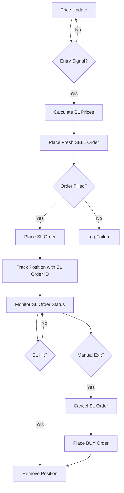

# PRD Analysis: Enhanced Survivor Strategy

## Executive Summary

This document provides a Product Requirements Document (PRD) analysis of the `ENHANCED_STRATEGY_ANALYSIS.md` file for the Enhanced Survivor Strategy - an advanced NIFTY options selling trading strategy with automated broker-level stop-loss (SL) order management.

---

## 1. Document Overview

| Attribute | Details |
|-----------|---------|
| **Document Type** | Technical Analysis & Implementation Guide |
| **Strategy Name** | Enhanced Survivor Strategy |
| **Core Function** | NIFTY Index Options Selling (PE/CE) with Technical Filters |
| **Primary Enhancement** | Automatic Broker-Level SL Order Placement |
| **Target Users** | Active options traders using the trading platform |
| **Implementation Status** | Partially Complete (SL feature ✅ implemented) |

---

## 2. Problem Statement Analysis

### 2.1 Critical Problem Identified (Before Fix)
```
┌─────────────────────────────────────────────────────────────────┐
│  RISK SCENARIO: Application-Level Stop-Loss Only               │
├─────────────────────────────────────────────────────────────────┤
│  ❌ SL calculated but NOT placed with broker                   │
│  ❌ In-memory monitoring only                                  │
│  ❌ App crash = Naked positions with no protection             │
│  ❌ Network issues = Missed exits, unlimited downside          │
└─────────────────────────────────────────────────────────────────┘
```

### 2.2 Risk Matrix
| Scenario | Impact | Probability | Risk Level |
|----------|--------|-------------|------------|
| Application Crash | Unlimited loss on open positions | Medium | 🔴 Critical |
| Network Disconnection | Delayed/missed SL execution | High | 🔴 Critical |
| Latency in Polling | Slippage on manual exit | Medium | 🟡 High |
| Manual Exit Delay | Greater loss than planned | Medium | 🟡 High |

---

## 3. Functional Requirements Analysis

### 3.1 Core Requirements

| ID | Requirement | Priority | Status |
|----|-------------|----------|--------|
| FR-001 | Automatic SL order placement immediately after fresh order | P0 | ✅ Implemented |
| FR-002 | Configurable SL percentage per position | P0 | ✅ Implemented |
| FR-003 | Support for STOP_LIMIT and STOP order types | P0 | ✅ Implemented |
| FR-004 | SL order ID tracking per position | P0 | ✅ Implemented |
| FR-005 | Automatic SL cancellation on manual exit | P0 | ✅ Implemented |
| FR-006 | Broker SL execution detection and tracking | P1 | ✅ Implemented |
| FR-007 | Fallback to legacy manual SL when broker SL disabled | P2 | ✅ Implemented |
| FR-008 | Emergency bulk exit (exit_positions) | P1 | 🔄 NOT NEEDED |
| FR-009 | Trailing SL at broker level | P2 | 🔄 Pending |
| FR-010 | Basket orders for atomic fresh+SL placement | P2 | 🔄 Pending |

### 3.2 Enhanced Features (Existing)

| Feature | Description | Configuration |
|---------|-------------|---------------|
| Technical Filters | RSI, EMA, ADX-based entry filtering | `entry_filter_type: ADX` |
| Dynamic Gaps | ATR-based gap adjustment | `enable_dynamic_gaps: true` |
| Position Limits | Max positions per side/total | `max_positions_per_side: 3` |
| Volatility Sizing | Position size based on volatility | `volatility_sizing: true` |
| Trailing Stop | Exit if profit falls from peak | `trailing_stop_enabled: false` |
| Daily Loss Limit | Stop trading at loss threshold | `max_daily_loss_percent: -3.0` |
| Time-Based Square Off | Auto-close at specified time | `square_off_time: "15:15"` |

---

## 4. Non-Functional Requirements

### 4.1 Performance Requirements
| Metric | Requirement | Notes |
|--------|-------------|-------|
| SL Order Placement Latency | < 2 seconds after fresh order | Critical for protection |
| SL Price Calculation | Real-time on entry | Based on entry price * (1 + sl%) |
| Position State Updates | Real-time via WebSocket | For dashboard monitoring |
| Order Cancellation | < 1 second on manual exit | Prevents duplicate orders |

### 4.2 Reliability Requirements
| Requirement | Implementation |
|-------------|----------------|
| Broker-Level Persistence | SL orders exist at broker, not just app |
| State Recovery | Position tracking survives app restarts |
| Fail-Safe Fallback | Manual SL check if broker SL fails |
| Order Correlation | Fresh order ID linked to SL order |

### 4.3 Security Requirements
- **Order Validation**: SL trigger price must be > entry price for shorts
- **Limit Price Buffer**: Configurable buffer to prevent order rejection
- **Permission Checks**: SL placement only for authenticated sessions

---

## 5. Architecture Analysis

### 5.1 Current Data Model (PositionInfo)

```
┌─────────────────────────────────────────────────────────────┐
│                     PositionInfo                            │
├─────────────────────────────────────────────────────────────┤
│  symbol: str                    # Option symbol             │
│  entry_price: float             # Entry premium             │
│  entry_time: datetime           # When position opened      │
│  quantity: int                  # Lot size                  │
│  option_type: str               # PE or CE                  │
│  current_pnl: float             # Running P&L               │
│  highest_pnl: float             # For trailing stop         │
│  sl_order_id: Optional[str]     # NEW: Broker SL order ID   │
│  sl_price: float                # NEW: SL trigger price     │
│  sl_limit_price: float          # NEW: SL limit price       │
└─────────────────────────────────────────────────────────────┘
```

### 5.2 Order Flow Architecture



### 5.3 Configuration Architecture

```yaml
# Core SL Configuration
sl_enabled: true              # Feature toggle
sl_percentage: 60             # Risk % from entry
sl_order_type: STOP_LIMIT     # Order type
sl_limit_buffer: 5.0          # Execution buffer

# Legacy Fallback
stop_loss_multiplier: 2.0     # Used when sl_enabled=false
```

---

## 6. Risk Management Analysis

### 6.1 SL Calculation Logic (Short Positions)

```python
# For SHORT positions (options selling)
entry_price = 50.0
sl_percentage = 60  # %
sl_limit_buffer = 5.0  # points

# Calculation
sl_trigger = entry_price * (1 + sl_percentage/100)
           = 50 * 1.60
           = 80.0

sl_limit = sl_trigger + sl_limit_buffer
         = 80 + 5
         = 85.0

# Risk per unit
risk_per_unit = sl_trigger - entry_price
              = 80 - 50
              = 30.0 (60% of entry)
```

### 6.2 Risk Scenarios by SL Percentage

| SL % | Entry ₹50 | Trigger | Risk/Unit | Max Loss (50 Qty) |
|------|-----------|---------|-----------|-------------------|
| 40%  | ₹50       | ₹70     | ₹20       | ₹1,000           |
| 60%  | ₹50       | ₹80     | ₹30       | ₹1,500           |
| 80%  | ₹50       | ₹90     | ₹40       | ₹2,000           |
| 100% | ₹50       | ₹100    | ₹50       | ₹2,500           |

### 6.3 Preset Configurations

| Preset | sl_percentage | sl_order_type | sl_limit_buffer | Use Case |
|--------|---------------|---------------|-----------------|----------|
| Conservative | 40% | STOP_LIMIT | 3.0 | Tight risk control |
| Moderate (Default) | 60% | STOP_LIMIT | 5.0 | Balanced risk/reward |
| Aggressive | 100% | STOP | 0 | Wide SL, market execution |
| Legacy Mode | N/A | N/A | N/A | Disable broker SL |

---

## 7. Implementation Gaps Analysis

### 7.1 Implemented (✅)

```
┌────────────────────────────────────────────────────────────┐
│ ✅ SL order placement after fresh order                    │
│ ✅ Configurable SL percentage                              │
│ ✅ STOP_LIMIT and STOP order type support                  │
│ ✅ SL order ID tracking per position                       │
│ ✅ SL cancellation on manual exit                          │
│ ✅ Broker SL execution detection                           │
│ ✅ Fallback to legacy manual SL                            │
│ ✅ Enhanced PositionInfo with SL fields                    │
│ ✅ Configuration in survivor_enhanced.yml                  │
└────────────────────────────────────────────────────────────┘
```

### 7.2 Pending Implementation (🔄)

| Priority | Feature | Impact | Effort |
|----------|---------|--------|--------|
| P1 | `exit_positions()` - Bulk emergency exit | High | Medium |
| P1 | `place_basket_orders()` - Atomic fresh+SL | High | Medium |
| P2 | `modify_sl_order()` - Trailing SL at broker | Medium | Medium |
| P2 | `convert_position()` - MIS to NRML | Medium | Low |
| P3 | `place_bracket_order()` - Entry+SL+Target | Low | High |
| P3 | `place_multileg_order()` - Complex strategies | Low | High |

### 7.3 Unimplemented Broker Methods: (NOT NEEDED)

| Method | Zerodha Driver | Impact | Priority |
|--------|---------------|--------|----------|
| `exit_positions()` | ❌ NotImplemented | Can't bulk exit | P1 |
| `convert_position()` | ❌ NotImplemented | Can't convert MIS↔NRML | P2 |
| `place_bracket_order()` | ❌ NotImplemented | Can't use BO | P3 |
| `place_basket_orders()` | ❌ NotImplemented | Can't place combined | P1 |
| `place_multileg_order()` | ❌ NotImplemented | Can't use multi-leg | P3 |

---

## 8. Testing Requirements Analysis

### 8.1 Test Checklist (from Analysis Doc)

| Test Case | Type | Priority | Status |
|-----------|------|----------|--------|
| Fresh order places successfully | Unit | P0 | ⬜ |
| SL order places immediately after fresh | Integration | P0 | ⬜ |
| SL price calculation correct (entry * 1.60) | Unit | P0 | ⬜ |
| PositionInfo tracks sl_order_id correctly | Unit | P1 | ⬜ |
| Manual exit cancels SL order | Integration | P0 | ⬜ |
| Broker SL execution detected and tracked | Integration | P1 | ⬜ |
| Stats show protected/unprotected positions | E2E | P2 | ⬜ |
| Fallback mode works when SL disabled | Integration | P2 | ⬜ |
| Config changes reflect in behavior | E2E | P2 | ⬜ |

### 8.2 Additional Test Scenarios Needed

| Scenario | Description |
|----------|-------------|
| Network Failure | SL order fails to place after fresh order |
| Partial Fill | Fresh order partially filled, SL for filled qty |
| Order Rejection | SL order rejected by broker (invalid price) |
| Rapid Price Movement | Entry and SL prices need adjustment |
| Multiple Positions | Same symbol, different entry times |

---

## 9. API & Integration Analysis

### 9.1 Web Backend Integration

The web backend provides analysis capabilities through:

```python
# Current Analysis Routes (web/backend/app/routes/analysis.py)
- POST /api/analysis/payoff       # Calculate position payoff
- POST /api/analysis/portfolio    # Portfolio-level analysis
- GET  /api/analysis/price/:symbol # Current price for symbol
```

### 9.2 Missing API Endpoints

| Endpoint | Purpose | Priority |
|----------|---------|----------|
| GET /api/positions/sl-status | Get SL order status for positions | P1 |
| POST /api/positions/modify-sl | Modify SL for open position | P2 |
| GET /api/risk/position-matrix | Risk matrix for all positions | P1 |
| POST /api/emergency/exit-all | Bulk exit all positions | P1 |

---

## 10. Recommendations

### 10.1 High Priority Actions

1. **Implement `exit_positions()` Method**
   - Required for emergency scenarios
   - Should cancel all SL orders and place market exits
   - Add to broker interface and all driver implementations

2. **Complete Test Suite**
   - Unit tests for SL calculation logic
   - Integration tests for order placement flow
   - E2E tests for complete position lifecycle

3. **Add Monitoring Dashboard**
   - Real-time SL order status display
   - Protected vs unprotected position count
   - SL hit statistics and performance metrics

### 10.2 Medium Priority Actions

4. **Implement Basket Orders**
   - Atomic fresh+SL placement reduces risk window
   - Reduces API call overhead
   - Prevents partial state (fresh without SL)

5. **Add Dynamic SL Adjustment**
   - Trail SL at broker level as position becomes profitable
   - Lock in profits while maintaining protection

### 10.3 Documentation Improvements

6. **Add Sequence Diagrams**
   - Complete order lifecycle visualization
   - Error handling flows
   - State transition diagrams

7. **Add Troubleshooting Guide**
   - Common SL order failures and resolutions
   - Manual intervention procedures

---

## 11. Conclusion

### 11.1 Summary

The `ENHANCED_STRATEGY_ANALYSIS.md` document provides a comprehensive analysis of the Enhanced Survivor Strategy, with particular focus on the critical stop-loss order placement feature. The document effectively:

- ✅ Identifies the critical risk gap (no broker-level SL)
- ✅ Documents the implemented solution in detail
- ✅ Provides clear configuration examples
- ✅ Outlines remaining work needed

### 11.2 Implementation Maturity: 70%

| Component | Completeness |
|-----------|--------------|
| Core SL Order Placement | 100% |
| Configuration & Flexibility | 100% |
| Position Tracking | 90% |
| Fallback Mechanisms | 80% |
| Bulk Operations | 0% |
| Testing Coverage | 30% |
| Documentation | 85% |

### 11.3 Next Milestone

**Target: Production-Ready SL Management**

1. Implement `exit_positions()` across all broker drivers
2. Complete integration test suite
3. Add monitoring dashboard for SL order status
4. Document operational procedures for traders

---

## Appendix A: Configuration Reference

```yaml
# Complete SL Configuration Section
sl_enabled: true                  # Master toggle
sl_percentage: 60                 # SL trigger % from entry
sl_order_type: STOP_LIMIT         # STOP or STOP_LIMIT
sl_limit_buffer: 5.0              # Buffer points for limit

# Legacy fallback
stop_loss_multiplier: 2.0         # Used when sl_enabled=false

# Related settings
trailing_stop_enabled: false
trailing_stop_distance: 0.5
max_daily_loss_percent: -3.0
square_off_time: "15:15"
```

## Appendix B: Key Files Reference

| File | Purpose |
|------|---------|
| `strategy/survivor_enhanced.py` | Strategy implementation |
| `strategy/configs/survivor_enhanced.yml` | Configuration |
| `brokers/core/interface.py` | Broker interface definitions |
| `brokers/integrations/zerodha/driver.py` | Zerodha implementation |
| `brokers/integrations/fyers/driver.py` | Fyers implementation |
| `ENHANCED_STRATEGY_ANALYSIS.md` | Original analysis document |
