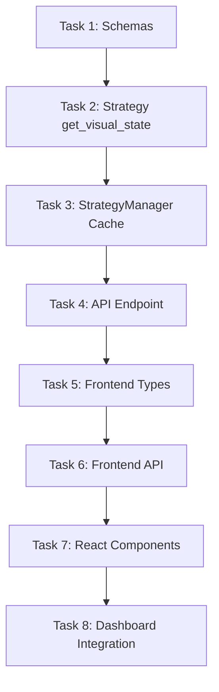

# Visual Engine Implementation Plan

## Overview
This document breaks down the Visual Engine feature into multiple independent coding tasks that can be worked on sequentially or in parallel.

## Task Dependencies

---

## Task 1: Backend - Add Visual State Schemas

**File:** `web/backend/app/models/schemas.py`

**Description:**
Add Pydantic models for the Visual Engine data structures.

**Changes Required:**
1. Add new enums: `FilterType`, `FilterStatusType`, `PredictionStatus`, `TrendDirection`, `VolatilityRegime`
2. Add `FilterStatus` model
3. Add `EntryPrediction` model  
4. Add `EntrySignal` model
5. Add `MarketContext` model
6. Add `DailyStats` model
7. Add `StrategyVisualState` response model

**Estimated Lines:** ~150 lines

**Dependencies:** None (first task)

**Acceptance Criteria:**
- All schemas validate correctly with FastAPI
- Type hints are complete
- Optional fields properly marked
- Default values set where appropriate

---

## Task 2: Strategy - Add get_visual_state() Method

**File:** `strategy/survivor.py`

**Description:**
Add a method to the SurvivorStrategy class that extracts current filter values, predictions, and signals.

**Changes Required:**
1. Add circular buffer for recent signals (max 20)
2. Add signal tracking in `should_take_position()` and entry methods
3. Add `get_visual_state()` method that returns:
   - Current filter statuses (RSI, EMA, ADX, Gap Risk)
   - Entry predictions for PE and CE
   - Recent signals history
   - Market context
   - Daily statistics
4. Add helper methods:
   - `_calculate_filter_statuses()`
   - `_calculate_entry_predictions()`
   - `_get_market_context()`

**Estimated Lines:** ~300 lines

**Dependencies:** Task 1 (for data structure reference)

**Acceptance Criteria:**
- Returns complete visual state when strategy is running
- Returns empty/default state when strategy is stopped
- Filter statuses reflect current market conditions
- Entry predictions calculate correctly based on gaps

---

## Task 3: Backend - StrategyManager Cache Integration

**File:** `web/backend/app/services/strategy_manager.py`

**Description:**
Modify StrategyManager to cache and expose visual state from the running strategy.

**Changes Required:**
1. Add `_visual_state_cache: Dict` instance variable
2. Add `_last_visual_state_update: datetime` timestamp
3. In `update_state()` or similar method, cache visual state from strategy
4. Add `get_visual_state() -> StrategyVisualState` method
5. Add `refresh_visual_state()` method to force update

**Estimated Lines:** ~80 lines

**Dependencies:** Task 2 (strategy must expose get_visual_state)

**Acceptance Criteria:**
- Visual state is cached when strategy is running
- Returns appropriate message when strategy not running
- Cache refreshes on each state update

---

## Task 4: Backend - Create API Endpoint

**File:** `web/backend/app/routes/visual.py` (new file)

**Description:**
Create new FastAPI router for the visual state endpoint.

**Changes Required:**
1. Create new file `web/backend/app/routes/visual.py`
2. Implement `GET /api/strategy/visual-state` endpoint
3. Return 503 if strategy not running with helpful message
4. Return cached visual state if available
5. Include `current_nifty_price` in response

**Also Update:**
- `web/backend/app/main.py` - Register the new router

**Estimated Lines:** ~60 lines (new file) + 3 lines (main.py)

**Dependencies:** Task 3 (StrategyManager must expose get_visual_state)

**Acceptance Criteria:**
- Endpoint returns 200 with visual state when strategy running
- Endpoint returns 503 when strategy stopped
- Response matches StrategyVisualState schema
- Proper error handling

---

## Task 5: Frontend - Add TypeScript Types

**File:** `web/frontend/types/index.ts`

**Description:**
Add TypeScript interfaces for all Visual Engine data structures.

**Changes Required:**
1. Add `FilterType` enum
2. Add `FilterStatusType` enum
3. Add `PredictionStatus` enum
4. Add `TrendDirection` enum
5. Add `VolatilityRegime` enum
6. Add `FilterStatus` interface
7. Add `EntryPrediction` interface
8. Add `EntrySignal` interface
9. Add `MarketContext` interface
10. Add `DailyStats` interface
11. Add `StrategyVisualState` interface

**Estimated Lines:** ~100 lines

**Dependencies:** Task 1 (backend schemas should be finalized)

**Acceptance Criteria:**
- All interfaces match backend schemas exactly
- No TypeScript compilation errors
- Proper use of optional fields (?)

---

## Task 6: Frontend - Add API Client Method

**File:** `web/frontend/lib/api.ts`

**Description:**
Add API method to fetch visual state from backend.

**Changes Required:**
1. Add `getVisualState(): Promise<StrategyVisualState>` method
2. Handle 503 errors gracefully
3. Add proper error messages for different error cases

**Estimated Lines:** ~25 lines

**Dependencies:** Task 4 (API endpoint must exist), Task 5 (types must exist)

**Acceptance Criteria:**
- Successfully fetches visual state when strategy running
- Returns null/empty state when 503 received
- Error handling works correctly

---

## Task 7: Frontend - Create VisualEngine Components

**Files:** 
- `web/frontend/components/VisualEngine/index.tsx` (main container)
- `web/frontend/components/VisualEngine/AlgoStatusCard.tsx`
- `web/frontend/components/VisualEngine/EntryRadar.tsx`
- `web/frontend/components/VisualEngine/FilterPanel.tsx`
- `web/frontend/components/VisualEngine/SignalTimeline.tsx`
- `web/frontend/components/VisualEngine/DailyStats.tsx`

**Description:**
Create React components for the Visual Engine dashboard.

**Component Details:**

### 7a. AlgoStatusCard.tsx
- Shows running/stopped status
- Displays uptime in human-readable format
- Shows strategy name

### 7b. EntryRadar.tsx
- Two cards for PE and CE predictions
- Shows current price vs trigger price
- Distance to trigger in points and percent
- Estimated time to entry
- Blocking reasons list

### 7c. FilterPanel.tsx
- Grid of filter status cards
- Each filter shows: name, value, threshold, status, message
- Color-coded: green=pass, red=fail, yellow=blocked, gray=disabled

### 7d. SignalTimeline.tsx
- List of recent signals (last 10-20)
- Timestamp, side (PE/CE), type (ENTRY/REJECTION/EXIT)
- Price and reason
- Color-coded by type

### 7e. DailyStats.tsx
- Trades taken count
- Trades rejected count
- P&L display (color-coded green/red)
- Consecutive losses

### 7f. index.tsx (Main Container)
- Orchestrates all sub-components
- Manages auto-refresh interval (5 seconds)
- Handles loading states
- Error display

**Estimated Lines:** ~600 lines total

**Dependencies:** Task 5 (types), Task 6 (API client)

**Acceptance Criteria:**
- All components render correctly with mock data
- Responsive layout works on different screen sizes
- Auto-refresh fetches new data every 5 seconds
- Loading and error states handled

---

## Task 8: Frontend - Integrate into Dashboard

**File:** `web/frontend/app/page.tsx`

**Description:**
Add VisualEngine to the main dashboard page.

**Changes Required:**
1. Import VisualEngine component
2. Add new tab or section for "Visual Engine" or "Strategy View"
3. Render VisualEngine component in that section
4. Ensure it only fetches data when strategy is running

**Estimated Lines:** ~30 lines

**Dependencies:** Task 7 (components must exist)

**Acceptance Criteria:**
- VisualEngine appears in dashboard
- Can toggle between views
- Auto-refresh works correctly
- Stops fetching when strategy stopped

---

## Summary

| Task | File | Lines | Dependencies |
|------|------|-------|--------------|
| 1 | `web/backend/app/models/schemas.py` | ~150 | None |
| 2 | `strategy/survivor.py` | ~300 | Task 1 |
| 3 | `web/backend/app/services/strategy_manager.py` | ~80 | Task 2 |
| 4 | `web/backend/app/routes/visual.py` | ~63 | Task 3 |
| 5 | `web/frontend/types/index.ts` | ~100 | Task 1 |
| 6 | `web/frontend/lib/api.ts` | ~25 | Task 4, 5 |
| 7 | `web/frontend/components/VisualEngine/*.tsx` | ~600 | Task 5, 6 |
| 8 | `web/frontend/app/page.tsx` | ~30 | Task 7 |

**Total Estimated Lines:** ~1350 lines

---

## Testing Checklist

### Backend Tests
- [ ] Schemas validate correctly with sample data
- [ ] `get_visual_state()` returns correct structure
- [ ] API endpoint returns 200 when strategy running
- [ ] API endpoint returns 503 when strategy stopped

### Frontend Tests
- [ ] Components render without errors
- [ ] Auto-refresh works at 5-second intervals
- [ ] All filter statuses display correctly
- [ ] Entry predictions show distance calculations
- [ ] Signal timeline shows recent signals
- [ ] Responsive layout works on mobile/desktop

### Integration Tests
- [ ] Full flow: strategy running → fetch visual state → display
- [ ] Stopping strategy updates visual to "stopped" state
- [ ] Starting strategy begins fetching visual state

---

**Ready to start coding?** Begin with Task 1 (Schemas) as it has no dependencies.