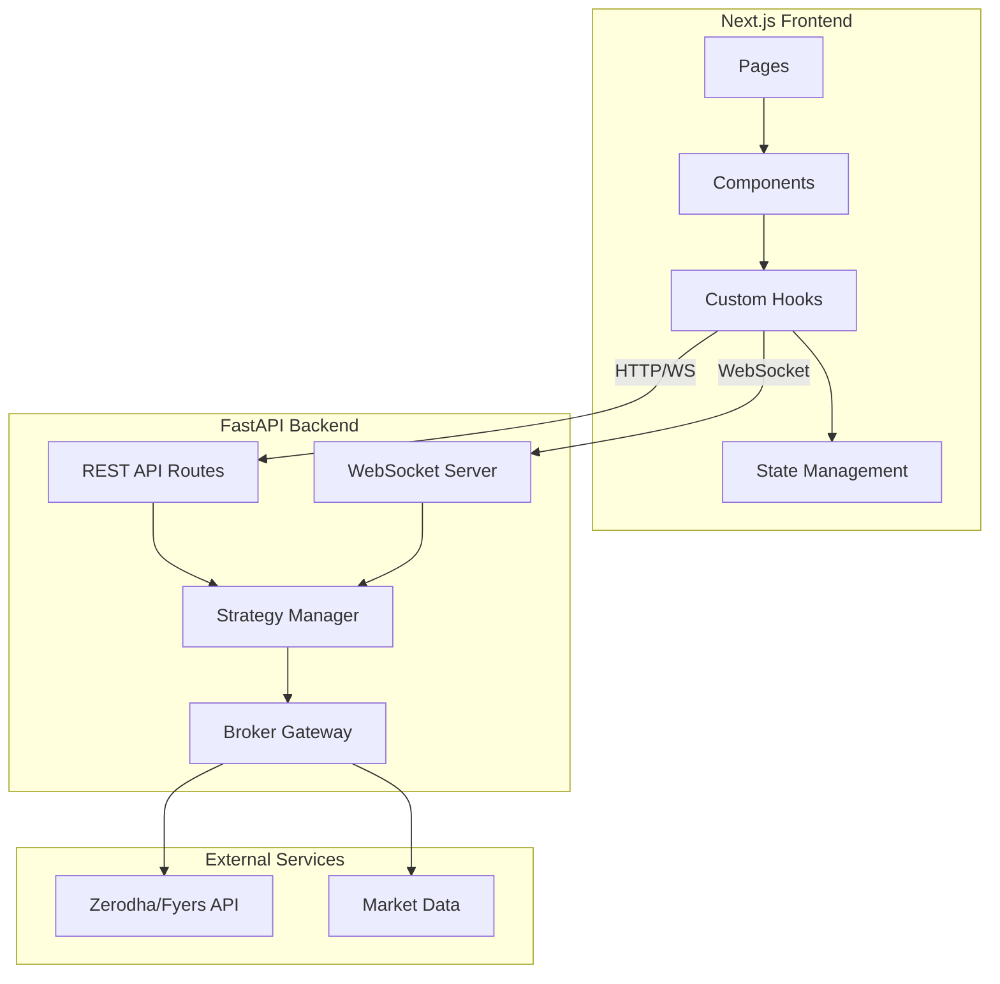
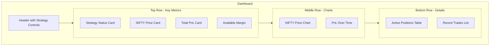

# Survivor Trading Strategy - Next.js UI Architecture Plan

## Overview

This document outlines the architecture for building a modern web-based UI for the Survivor trading strategy. The system consists of a FastAPI backend for API and WebSocket communication, and a Next.js frontend for the user interface.

## System Architecture



## Project Structure

```
trading-algo/
├── web/                          # Web application root
│   ├── backend/                  # FastAPI backend
│   │   ├── app/
│   │   │   ├── __init__.py
│   │   │   ├── main.py          # FastAPI app entry point
│   │   │   ├── config.py        # Configuration management
│   │   │   ├── routes/
│   │   │   │   ├── __init__.py
│   │   │   │   ├── strategy.py  # Strategy control endpoints
│   │   │   │   ├── positions.py # Position management
│   │   │   │   ├── orders.py    # Order management
│   │   │   │   ├── config.py    # Configuration endpoints
│   │   │   │   └── market.py    # Market data endpoints
│   │   │   ├── websocket/
│   │   │   │   ├── __init__.py
│   │   │   │   ├── manager.py   # WebSocket connection manager
│   │   │   │   └── handlers.py  # WebSocket event handlers
│   │   │   ├── services/
│   │   │   │   ├── __init__.py
│   │   │   │   ├── strategy_manager.py  # Strategy lifecycle management
│   │   │   │   ├── broker_service.py    # Broker operations wrapper
│   │   │   │   └── state_manager.py     # Application state management
│   │   │   └── models/
│   │   │       ├── __init__.py
│   │   │       ├── requests.py   # Pydantic request models
│   │   │       └── responses.py  # Pydantic response models
│   │   ├── requirements.txt
│   │   └── pyproject.toml
│   │
│   └── frontend/                 # Next.js frontend
│       ├── app/                  # App router pages
│       │   ├── layout.tsx
│       │   ├── page.tsx         # Dashboard home
│       │   ├── config/
│       │   │   └── page.tsx     # Configuration editor
│       │   ├── history/
│       │   │   └── page.tsx     # Trade history
│       │   └── positions/
│       │       └── page.tsx     # Position details
│       ├── components/
│       │   ├── layout/
│       │   │   ├── Sidebar.tsx
│       │   │   ├── Header.tsx
│       │   │   └── Layout.tsx
│       │   ├── dashboard/
│       │   │   ├── StrategyStatus.tsx
│       │   │   ├── NiftyPriceCard.tsx
│       │   │   ├── PositionsTable.tsx
│       │   │   ├── PnLChart.tsx
│       │   │   └── RecentTrades.tsx
│       │   ├── config/
│       │   │   ├── ConfigEditor.tsx
│       │   │   └── ConfigForm.tsx
│       │   ├── charts/
│       │   │   ├── PriceChart.tsx
│       │   │   └── PnLGraph.tsx
│       │   └── ui/              # Reusable UI components
│       │       ├── Button.tsx
│       │       ├── Card.tsx
│       │       ├── Input.tsx
│       │       ├── Table.tsx
│       │       └── Badge.tsx
│       ├── hooks/
│       │   ├── useWebSocket.ts  # WebSocket connection hook
│       │   ├── useStrategy.ts   # Strategy state hook
│       │   └── useMarketData.ts # Market data hook
│       ├── lib/
│       │   ├── api.ts          # API client
│       │   └── utils.ts        # Utility functions
│       ├── types/
│       │   └── index.ts        # TypeScript types
│       ├── public/
│       ├── package.json
│       ├── tsconfig.json
│       ├── tailwind.config.js
│       └── next.config.js
│
├── strategy/                     # Existing strategy code
├── brokers/                      # Existing broker code
└── plans/                        # Architecture documents
```

## Backend API Design

### REST Endpoints

#### Strategy Control
| Method | Endpoint | Description |
|--------|----------|-------------|
| GET | `/api/strategy/status` | Get current strategy status |
| POST | `/api/strategy/start` | Start the strategy |
| POST | `/api/strategy/stop` | Stop the strategy |
| POST | `/api/strategy/restart` | Restart the strategy |

#### Configuration
| Method | Endpoint | Description |
|--------|----------|-------------|
| GET | `/api/config` | Get current configuration |
| PUT | `/api/config` | Update configuration |
| POST | `/api/config/validate` | Validate configuration |

#### Positions & Orders
| Method | Endpoint | Description |
|--------|----------|-------------|
| GET | `/api/positions` | Get current positions |
| GET | `/api/orders` | Get order book |
| GET | `/api/trades` | Get trade history |
| GET | `/api/orders/{order_id}` | Get specific order details |

#### Market Data
| Method | Endpoint | Description |
|--------|----------|-------------|
| GET | `/api/market/quote/{symbol}` | Get quote for symbol |
| GET | `/api/market/nifty` | Get NIFTY index data |

#### Account
| Method | Endpoint | Description |
|--------|----------|-------------|
| GET | `/api/account/funds` | Get account funds/margin |

### WebSocket Events

#### Server to Client
```typescript
// Price updates
{
  type: 'PRICE_UPDATE',
  data: {
    symbol: 'NSE:NIFTY 50',
    last_price: 24500.50,
    timestamp: '2024-01-15T10:30:00Z'
  }
}

// Strategy state updates
{
  type: 'STRATEGY_STATE',
  data: {
    status: 'RUNNING',
    nifty_pe_last_value: 24500,
    nifty_ce_last_value: 24500,
    pe_reset_flag: false,
    ce_reset_flag: true
  }
}

// Order updates
{
  type: 'ORDER_UPDATE',
  data: {
    order_id: '123456',
    symbol: 'NIFTY26FEB24300PE',
    status: 'COMPLETE',
    quantity: 50,
    price: 45.5
  }
}

// Position updates
{
  type: 'POSITION_UPDATE',
  data: {
    symbol: 'NIFTY26FEB24300PE',
    quantity: -50,
    average_price: 45.5,
    pnl: 250.00
  }
}
```

#### Client to Server
```typescript
// Subscribe to symbols
{
  type: 'SUBSCRIBE',
  symbols: ['NSE:NIFTY 50', 'NIFTY26FEB24300PE']
}

// Unsubscribe from symbols
{
  type: 'UNSUBSCRIBE',
  symbols: ['NIFTY26FEB24300PE']
}
```

## Frontend Design

### Dashboard Page

The main dashboard provides a comprehensive view of the trading strategy:



### Key Components

#### 1. Strategy Status Card
- Shows current strategy state: RUNNING, STOPPED, ERROR
- Start/Stop/Restart buttons
- Last action timestamp
- Strategy health indicators

#### 2. NIFTY Price Card
- Real-time NIFTY price with WebSocket updates
- Price change indicator with color coding
- PE/CE reference values visualization
- Gap thresholds display

#### 3. Positions Table
- Symbol, Quantity, Average Price
- Current Price, PnL, PnL%
- Action buttons for manual square-off
- Real-time price updates

#### 4. Configuration Editor
- Form-based configuration editing
- Parameter grouping by category
- Validation before save
- Preset configurations

#### 5. Trade History
- Paginated table of historical trades
- Filtering by date, symbol, type
- Export to CSV functionality
- Trade analytics summary

### State Management

Using React Context + SWR for data fetching:

```typescript
// Strategy context
interface StrategyContextType {
  status: 'RUNNING' | 'STOPPED' | 'ERROR' | 'STARTING';
  config: StrategyConfig;
  positions: Position[];
  orders: Order[];
  startStrategy: () => Promise<void>;
  stopStrategy: () => Promise<void>;
  updateConfig: (config: Partial<StrategyConfig>) => Promise<void>;
}
```

## Technology Stack

### Backend
- **Framework**: FastAPI
- **WebSocket**: FastAPI WebSocket with connection manager
- **Validation**: Pydantic
- **Async**: asyncio for concurrent operations
- **Process Management**: multiprocessing for strategy isolation

### Frontend
- **Framework**: Next.js 14 with App Router
- **Language**: TypeScript
- **Styling**: Tailwind CSS
- **Charts**: Recharts or TradingView lightweight charts
- **State**: React Context + SWR
- **WebSocket**: Native WebSocket API with reconnection logic
- **UI Components**: Custom components with Tailwind

## Security Considerations

1. **API Authentication**: JWT-based authentication for API endpoints
2. **WebSocket Authentication**: Token-based connection authentication
3. **CORS**: Configure allowed origins for frontend
4. **Rate Limiting**: Implement rate limiting on API endpoints
5. **Input Validation**: Strict validation on all inputs
6. **Environment Variables**: Secure storage of broker credentials

## Implementation Phases

### Phase 1: Core Backend
1. Set up FastAPI project structure
2. Implement REST API endpoints
3. Create WebSocket server
4. Integrate with existing broker gateway
5. Implement strategy manager service

### Phase 2: Core Frontend
1. Set up Next.js project with TypeScript
2. Create layout and navigation
3. Implement dashboard page
4. Create configuration editor
5. Add WebSocket integration

### Phase 3: Real-time Features
1. Real-time price updates via WebSocket
2. Live position updates
3. Order status notifications
4. Strategy state synchronization

### Phase 4: Advanced Features
1. Historical data and charts
2. Trade analytics
3. Export functionality
4. Error handling and recovery

## Configuration Models

### Strategy Configuration
```typescript
interface StrategyConfig {
  // Core Parameters
  index_symbol: string;
  symbol_initials: string;
  
  // Gap Parameters
  pe_gap: number;
  ce_gap: number;
  pe_reset_gap: number;
  ce_reset_gap: number;
  
  // Strike Selection
  pe_symbol_gap: number;
  ce_symbol_gap: number;
  
  // Position Sizing
  pe_quantity: number;
  ce_quantity: number;
  
  // Risk Management
  min_price_to_sell: number;
  sell_multiplier_threshold: number;
  
  // Reference Points
  pe_start_point: number;
  ce_start_point: number;
  
  // Order Settings
  exchange: 'NFO';
  order_type: 'MARKET' | 'LIMIT';
  product_type: 'NRML' | 'MIS';
  trans_type: 'BUY' | 'SELL';
  
  // Entry Filters
  entry_filter_type: 'NONE' | 'RSI_ADX' | 'EMA' | 'BOTH';
  rsi_period: number;
  rsi_min: number;
  rsi_max: number;
  adx_period: number;
  adx_threshold: number;
  ema_period: number;
}
```

### Position Model
```typescript
interface Position {
  symbol: string;
  exchange: string;
  quantity: number;
  average_price: number;
  current_price: number;
  pnl: number;
  pnl_percent: number;
  product_type: string;
}
```

### Order Model
```typescript
interface Order {
  order_id: string;
  symbol: string;
  transaction_type: 'BUY' | 'SELL';
  quantity: number;
  price: number;
  status: 'PENDING' | 'COMPLETE' | 'CANCELLED' | 'REJECTED';
  timestamp: string;
  tag: string;
}
```

## Error Handling

### Backend Error Responses
```python
class APIError(Exception):
    def __init__(self, code: str, message: str, details: dict = None):
        self.code = code
        self.message = message
        self.details = details or {}

# Error codes
STRATEGY_NOT_RUNNING = 'STRATEGY_NOT_RUNNING'
STRATEGY_ALREADY_RUNNING = 'STRATEGY_ALREADY_RUNNING'
INVALID_CONFIGURATION = 'INVALID_CONFIGURATION'
BROKER_ERROR = 'BROKER_ERROR'
MARKET_CLOSED = 'MARKET_CLOSED'
```

### Frontend Error Handling
- Toast notifications for errors
- Retry mechanisms for failed requests
- Graceful WebSocket reconnection
- Error boundary components

## Monitoring & Logging

### Backend Logging
- Structured JSON logging
- Request/response logging
- Strategy event logging
- WebSocket connection logging

### Frontend Monitoring
- Console logging in development
- Error tracking
- Performance monitoring
- User action logging

## Next Steps

1. **Review and approve** this architecture plan
2. **Switch to Code mode** to begin implementation
3. **Start with Phase 1** - Core Backend implementation
4. **Iterate** based on testing and feedback
